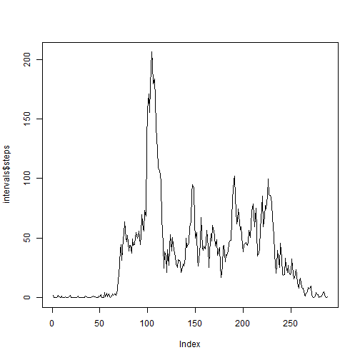
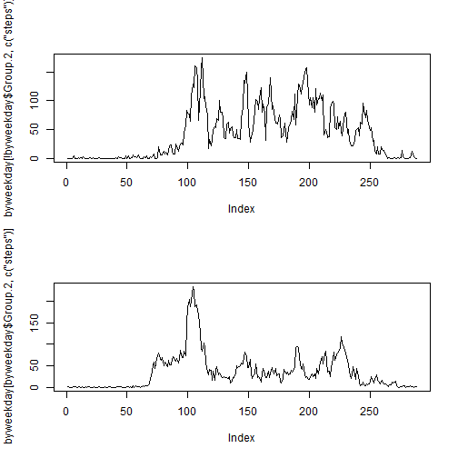

Load and summarise the activity data


```r
data = read.csv("activity.csv")
hist(data$steps)
```

 

```r
summary(data$steps)
```

```
##    Min. 1st Qu.  Median    Mean 3rd Qu.    Max.    NA's 
##     0.0     0.0     0.0    37.4    12.0   806.0    2304
```

Looking at 5min intervals.


```r
intervals = aggregate(data[,c("steps","interval")], list(data$interval), mean, na.rm = TRUE)
plot(intervals$steps,type = "l")
```

 

```r
max = max(intervals$steps)
maxindex = which.max(intervals$steps)
interval = intervals$interval[maxindex]
interval
```

```
## [1] 835
```

Repeat by weekend/weekday.


```r
weekdaysD = weekdays(as.Date(data$date))
weekdays =  as.POSIXlt(data$date)$wday>0 & as.POSIXlt(data$date)$wday<6
data_week = cbind(data,weekdays)
byweekday = aggregate(data_week[,c("steps","interval")], list(data_week$interval,data_week$weekdays), mean, na.rm = TRUE)
par(mfrow=c(2,1)) 
plot(byweekday[!byweekday$Group.2,c("steps")],type = "l")
plot(byweekday[byweekday$Group.2,c("steps")],type = "l")
```

 

